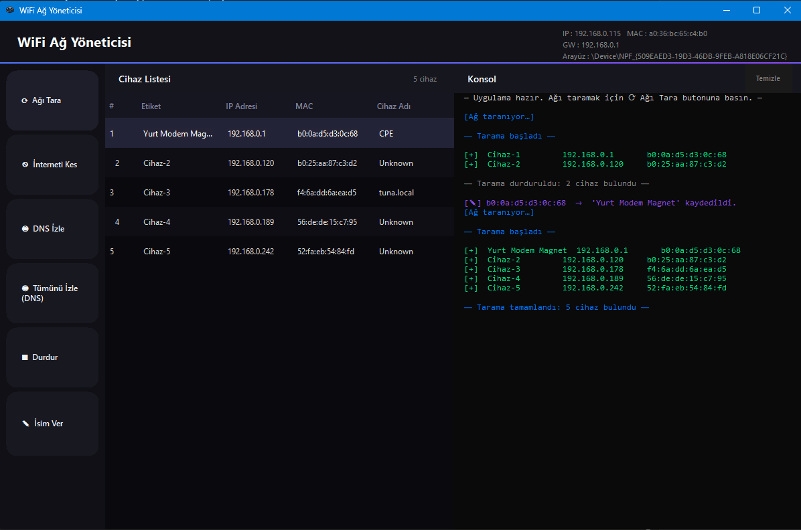

# WifiManager — Proje Dokümantasyonu



## 1. Proje Özeti

**WifiManager**, aynı Wi-Fi ağındaki cihazları tespit eden, isimlendirebilen, seçilen cihazın internet bağlantısını kesen ve ağdaki DNS sorgularını izleyebilen bir Windows masaüstü uygulamasıdır. Uygulama C# ile geliştirilmiş olup Windows Forms arayüzü kullanmaktadır.

Projenin temel amacı; ağ yöneticilerinin veya ev kullanıcılarının kendi yerel ağlarında hangi cihazların bulunduğunu görebilmesini ve gerektiğinde belirli cihazlara erişim kısıtlaması uygulayabilmesini sağlamaktır.

---

## 2. Sistem Gereksinimleri

| Gereksinim | Açıklama |
|---|---|
| **İşletim Sistemi** | Windows 10 / 11 (64-bit) |
| **Yetki** | Yönetici (Administrator) yetkisi zorunlu |
| **Npcap** | v1.60 veya üzeri — [https://npcap.com](https://npcap.com) |
| **SQL Server** | SQL Server 2019/2022 Express — `localhost\SQLEXPRESS` instance'ı |
| **.NET Runtime** | Self-contained yayında gerekmez; Debug build için .NET 10 gerekli |

> **Npcap neden zorunlu?**
> Uygulama, ARP paketleri göndermek ve DNS trafiğini dinlemek için ağ kartına ham (raw) erişim ister. Windows'un standart soket API'si bu düzeyde erişime izin vermez. Npcap, çekirdek seviyesinde (kernel-mode) bir sürücü kurarak bu erişimi mümkün kılar.

---

## 3. Proje Yapısı

```
WifiManager/
├── Program.cs                  # Giriş noktası — yetki & Npcap kontrolü
├── MainForm.cs                 # Ana pencere — kullanıcı arayüzü mantığı
├── MainForm.Designer.cs        # Windows Forms tasarımcı çıktısı
├── DependencyForm.cs           # Npcap kurulmamışsa gösterilen bilgi penceresi
├── Models/
│   └── DeviceInfo.cs           # Cihaz veri modeli (IP, MAC, Hostname, Label)
├── Core/
│   ├── NetworkHelper.cs        # Yerel IP/MAC/Gateway tespiti, IP Forwarding
│   ├── ArpTool.cs              # ARP tarama, engelleme, ARP onarma
│   ├── DnsMonitor.cs           # DNS izleme (MITM + paket yakalama)
│   └── DeviceStore.cs          # SQL Server cihaz ismi kalıcı depolama
├── assets/
│   └── icon-source.png         # Uygulama ikonu kaynak görseli
├── app.ico                     # Uygulama ikonu (16/32/48/64/128/256 px)
├── app.manifest                # Yönetici yetkisi bildirgesi
└── WifiManager.csproj          # .NET 10 proje dosyası
```

---

## 4. Kullanılan Teknolojiler ve Kütüphaneler

| Teknoloji | Sürüm | Kullanım Amacı |
|---|---|---|
| C# / .NET 10 | 10.0 | Ana geliştirme platformu |
| Windows Forms | .NET 10 | Masaüstü kullanıcı arayüzü |
| **SharpPcap** | 6.3.0 | Ağ kartına ham paket erişimi (Npcap wrapper) |
| **PacketDotNet** | 1.4.7 | ARP, Ethernet, IP, UDP paket oluşturma/ayrıştırma |
| **Microsoft.Data.SqlClient** | 7.0.1 | SQL Server bağlantısı ve sorguları |
| SQL Server 2022 Express | — | Cihaz isimlerinin kalıcı saklanması |

---

## 5. Uygulama Başlangıç Akışı (`Program.cs`)

Uygulama açıldığında üç kontrol sırayla yapılır:

1. **Yönetici Yetkisi Kontrolü** — `WindowsPrincipal.IsInRole(Administrator)` ile kontrol edilir. Yetki yoksa `runas` fiiliyle uygulama kendini yeniden başlatır.

2. **Npcap Kontrolü** — İki yöntemle:
   - Registry anahtarı: `HKLM\SOFTWARE\Npcap`
   - Dosya varlığı: `System32\Npcap\wpcap.dll` veya `Program Files\Npcap\wpcap.dll`
   
   Npcap bulunamazsa kullanıcıya kurulum talimatları içeren `DependencyForm` gösterilir ve ana pencere açılmaz.

3. **Önceki Oturum Temizliği** — `NetworkHelper.ResetNetworkState()` çağrılarak, önceki oturumun açık bırakmış olabileceği Windows IP Forwarding kapatılır.

---

## 6. Ağ Taraması — Nasıl Çalışır? (`ArpTool.cs`)

### 6.1 Yerel Ağ Tespiti (`NetworkHelper.cs`)

`GetLocalIP()` metodu, bilgisayarın aktif ağ bağlantısına ait IP adresini bulur. İki aşamalıdır:

1. **Socket Trick**: `8.8.8.8:80`'e UDP soketi bağlanır (gerçek paket gönderilmez). Windows, bu işlemde routing tablosunu ve metrik değerlerini uygulayarak en uygun ağ kartını seçer ve `LocalEndPoint.Address` doğru IP'yi verir.

2. **VPN Filtresi**: Socket trick VPN arayüzünü seçmişse (Örn: OpenVPN, Hyper-V vEthernet), arayüz tanımı (Description) kontrol edilerek fiziksel kart tercih edilir. Filtreden geçen anahtar kelimeler: `VPN`, `Virtual`, `TAP`, `Tunnel`, `Pseudo`, `Hyper-V`, `vEthernet`.

`GetSubnetHosts()` gerçek subnet maskesini okuyarak taranacak IP listesini oluşturur. Büyük ağlarda (örn. /21) tüm 2046 host yerine yerel IP etrafında ortalanmış 1022 host taranır.

### 6.2 Tarama Aşamaları (`ScanAsync`)

Tarama başlamadan önce Windows ARP cache temizlenir (`arp -d *`). Böylece kapalı cihazların eski kayıtları listelenmez.

Üç paralel yöntem birlikte çalışır:

**① ARP Broadcast** — Her host için Ethernet katmanında broadcast ARP Request paketi gönderilir. Her turda tüm subnet taranır, 12 tur boyunca 800ms aralıklarla tekrarlanır. Aktif cihazlar ARP Response ile yanıt verir.

**② Ping Sweep** — Subnet'teki tüm host'lara ICMP Echo isteği gönderilir (16'lık batch'ler halinde). Ping, cihazı uyandırır ve Windows'un ARP cache'ini doldurur.

**③ ARP Cache Okuma** — `arp -a` komutu çıktısı ayrıştırılır. Ping sweep'in doldurduğu ve ARP broadcast'in kaçırdığı cihazlar buradan eklenir.

Üç kaynaktan gelen sonuçlar IP ve MAC bazında tekrar kontrolü yapılarak birleştirilir ve IP sırasına göre listelenir.

---

## 7. Cihaz Engelleme — ARP Spoofing (`ArpTool.cs`)

### Temel Kavram

ARP (Address Resolution Protocol), IP adresinin hangi MAC adresine karşılık geldiğini öğrenmek için kullanılır. ARP yanıtları doğrulanmaz; herhangi bir cihaz yanlış bilgi içeren ARP Reply gönderebilir.

Bu zafiyet kullanılarak:
- Hedef cihaza: "gateway'in MAC'i benim MAC'im" mesajı gönderilir
- Gateway'e: "hedefin MAC'i benim MAC'im" mesajı gönderilir

Sonuç: Hedef cihazın paketleri gateway yerine saldırgan makinesine gelir. Gateway yanıtları da saldırgan makinesine gelir. Ancak IP Forwarding kapalıysa paketler iletilmez — bu da hedefin internet bağlantısını keser.

### `StartBlocking()` Akışı

```
Her 1500ms'de bir:
  ├── Hedefe gönder: "gateway IP'si → benim MAC'im"
  └── Gateway'e gönder: "hedef IP'si → benim MAC'im"

İptal edilince:
  └── RestoreARP() — 5 kez gerçek MAC'leri yayınla
```

### ARP Onarma (`RestoreARP`)

Engelleme durdurulduğunda, hedef ve gateway'e gerçek MAC bilgileri 5 kez gönderilir. Bu sayede ARP tabloları düzelir ve internet bağlantısı geri gelir.

---

## 8. DNS İzleme — MITM (`DnsMonitor.cs`)

### Çalışma Prensibi

DNS izleme, ARP spoofing'in üzerine inşa edilmiştir:

1. **MITM Kurulumu** — `_arp.StartMitm()` hedef cihaz(lar) ve gateway arasında ARP spoof döngüsü başlatır. Bu sefer IP Forwarding **açılır**, paketler iletilir — hedefin interneti kesilmez.

2. **IP Forwarding** — İki katmanlı açılır:
   - Global (Registry): `HKLM\SYSTEM\...\Tcpip\Parameters → IPEnableRouter=1`
   - Arayüz bazlı (netsh): `netsh interface ipv4 set interface "Wi-Fi" forwarding=enabled`

3. **DNS Paket Yakalama** — SharpPcap ile ağ kartı promiscuous modda açılır. BPF filtresi `udp dst port 53 and src host <hedef_ip>` yalnızca hedefin DNS sorgularını yakalar.

4. **DNS Paketi Ayrıştırma** — RFC 1035 formatına göre ham UDP payload'u işlenir. DNS query bölümünden sorgulan domain adı çıkarılır.

### Oturum Güvenliği

Hızlı başlat/durdur senaryolarında eski oturumun MITM döngüsü yeni oturumla çakışmaması için:
- `prevTask.Wait(5s)` — yeni oturum, eskisi tamamen bitmeden başlamaz
- `sessionId` kontrolü — IP Forwarding sadece en son oturum tarafından kapatılır
- `CancellationTokenSource.CreateLinkedTokenSource` — SniffDns erken çıksa bile MITM durdurulur

### Temizlik

İzleme durdurulunca:
1. MITM döngüsü iptal edilir
2. `RestoreARP()` gerçek MAC'leri yayınlar
3. IP Forwarding kapatılır (hem registry hem netsh)
4. Ağ kartı kapatılır

---

## 9. Cihaz İsimlendirme — SQL Server Entegrasyonu (`DeviceStore.cs`)

### Veri Tabanı Tasarımı

```sql
CREATE TABLE Devices (
    MAC  NVARCHAR(17)  NOT NULL PRIMARY KEY,
    Name NVARCHAR(100) NOT NULL
);
```

Bağlantı dizesi: `Server=localhost\SQLEXPRESS;Database=WifiManager;Integrated Security=true;TrustServerCertificate=true;`

### Çalışma Mantığı

`DeviceStore` iki katmanlı çalışır:

| Katman | Amaç |
|---|---|
| **Bellek Cache** (`_names` dict) | Her sorguda SQL bağlantısı açmamak için |
| **SQL Server** | Uygulama kapatılıp açılsa da isimlerin kalıcı olması için |

**İsim okuma** (`ResolveName`):
1. Cache'de özel isim var mı? → Varsa döndür
2. Oturumda otomatik ID verildi mi? → Varsa döndür
3. İkisi de yoksa → `Cihaz-1`, `Cihaz-2`, ... şeklinde otomatik ID ata

**İsim yazma** (`SetName`): Önce cache güncellenir (anlık görünüm için), sonra SQL MERGE komutu ile hem INSERT hem UPDATE işlemi atomik olarak gerçekleştirilir:

```sql
MERGE Devices AS target
USING (VALUES (@mac, @name)) AS src (MAC, Name)
ON target.MAC = src.MAC
WHEN MATCHED     THEN UPDATE SET Name = src.Name
WHEN NOT MATCHED THEN INSERT (MAC, Name) VALUES (src.MAC, src.Name);
```

---

## 10. Kullanıcı Arayüzü (`MainForm.cs`)

Ana pencerede üç sekme bulunur:

### Sekme 1 — Ağ Taraması
- **Tara** butonu ile ağ taraması başlatılır
- Bulunan cihazlar tabloda listelenir: İsim, IP, MAC, Hostname
- Cihaza çift tıklayarak özel isim verilebilir
- **Engelle** butonu seçili cihazın internet bağlantısını keser
- **Durdur** butonu engellemeyi sonlandırır ve ARP onarır

### Sekme 2 — DNS İzleme
- Tek cihaz veya tüm cihazlar için DNS izleme başlatılabilir
- Gerçek zamanlı DNS sorguları tabloda gösterilir: Saat, Cihaz İsmi, IP, MAC, Domain

### Sekme 3 — Hakkında / Durum
- Yerel IP, MAC, Gateway bilgileri gösterilir
- Uygulama log çıktıları görüntülenir

---

## 11. Güvenlik ve Etik Kullanım

Bu uygulama **yalnızca kendi ağınızda** kullanılmak üzere geliştirilmiştir. Başkalarının ağlarında izinsiz kullanımı Türk Ceza Kanunu'nun 243. ve 244. maddeleri kapsamında suç teşkil eder.

ARP spoofing tekniği, ağ güvenliği eğitimi ve kendi ağınızın yönetimi için meşru kullanım alanlarına sahiptir.

---

## 12. Derleme ve Yayın

### Debug Build (Geliştirme)
```
dotnet build
```

### Self-Contained Yayın (Dağıtım)
```
dotnet publish -p:PublishProfile=SelfContained
```
Çıktı: `bin\Release\net10.0-windows\win-x64\publish\`

Self-contained yayında .NET 10 runtime derlemeye dahil edilir; hedef makinede .NET kurulu olması gerekmez. Yalnızca Npcap ve SQL Server gereksinimler olarak kalır.

---

## 13. Bağımlılıklar ve Kurulum

### Npcap
1. [https://npcap.com/#download](https://npcap.com/#download) adresinden indirin
2. Kurulum sırasında **"WinPcap API-compatible Mode"** seçeneğini işaretleyin
3. Kurulum tamamlandıktan sonra uygulamayı yeniden başlatın

### SQL Server Express
1. [Microsoft SQL Server Express](https://www.microsoft.com/tr-tr/sql-server/sql-server-downloads) adresinden indirin
2. Instance adı `SQLEXPRESS` olarak kurulum yapın
3. Windows Authentication (Integrated Security) yeterlidir; ek yapılandırma gerekmez
4. Uygulama ilk açılışta `WifiManager` veritabanını ve `Devices` tablosunu otomatik oluşturur
